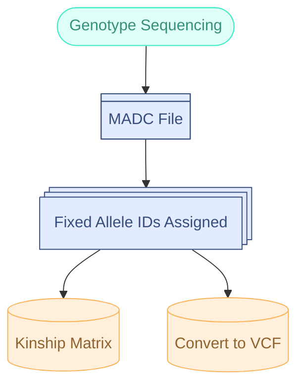

> Extracting SNPs from an MADC files requires that Fixed Allele Ids have already been assigned.
{: .prompt-warning }

## Introduction



The `BIGr` package provides a suite of functions developed by the Breeding Insight program to analyze diploid and polyploid breeding and genetic data. It is designed to handle common genomics tasks, including filtering Variant Call Format (VCF) files, processing Diversity Arrays Technology (DArT) data, and manipulating genotype data for various species.

This vignette will walk you through a common workflow:

2.  **Preparing MADC** to remove low quality microhaplotypes.
1.  **Converting DArT MADC files** to the more standard VCF format with biallelic SNPs.
2.  **Calculating dosages** with the `updog` R package.
2.  **Filtering** the resulting VCF file to ensure data quality.
4.  **Performing quality control** checks on the filtered data.
5.  **Calculating summary statistics** like Minor Allele Frequency (MAF) and Heterozygosity.

## Loading the Required Packages and Example Data

We need to load the packages that we will be using for this tutorial
```R
library(BIGr)
library(updog)
library(readr)
library(vcfR)
```

We will be working with an example MADC file that is provided with the `BIGr` package.
```R
madc_file_path <- system.file("example_MADC_FixedAlleleID.csv", package="BIGr")
```

## Preprocessing the MADC File

The MADC file contains the read count information for all of the target loci in the genotyping panel ***plus*** the alleles associated with each target region. The format has the microhaplotypes in the rows and the samples in the columns. Sometimes, these other alleles are not reliable due to having a much higher read depth than expected (likely from applification by duplicate sites) or extremely low read depth (potentially from sequencing errors).

So, we will first evaluate some basic statistics of these MADC files and then filter to remove these low-quality microhaplotypes.

Let's first import the MADC file as a data frame object
```R
#Import MADC
MADC <- read.csv(madc_file_path, sep=',', check.names = FALSE)
```
In our example MADC file, we only have 10 individuals and 50 microhaplotypes.


Now we can check to see which microhaploypes have a read depth of at least 10 for at least two samples.
```R
#Convert any read depths less than 10 to NA, otherwise switch to a value of 1.
MADC_count <- ifelse(MADC[,-c(1:3)] < 10, NA, 1) # Use a value less than 10 if you feel it is too stringent of a read depth value

#Sum up the number of individuals with at least a read depth of 10 for each microhaplotype
MADC_sums <- rowSums(MADC_count, na.rm = TRUE)

#Make a histogram of the distribution
hist(MADC_sums, breaks = 50, 
     main = "Distribution of mHaps with individuals with >10 Reads",
     xlab = "Number of samples at each mHap with >10 reads",
     ylab = "Frequency")
abline(v=mean(MADC_sums),col="blue")
abline(v=10,col="orange")

#Counting the number of individuals removed with thresholds:
sum(MADC_sums < 2) #We will remove 12 microhaplotypes with this threshold
sum(MADC_sums < 5) #20
```
Typically, we like to set a minimum read depth of a microhaplotype at each sample as 10, but this is not always possible if the overall quality of the genotyping data is low. This can happen if lower quality tissue or DNA was used for sequencing.

Another metric we should evaluate is the distribution of the mean read depth across all samples for each microhaplotype
```R
#Get the distribution of read counts and mHaps
mean_reads <- data.frame(rowMeans(MADC[,-c(1:3)], na.rm = TRUE))

#Calculate the upper bound of the 95th percentile for the mean read depths.
upper_bound <- quantile(mean_reads[,1], 0.95)

#Plot the distribution
hist(mean_reads[,1])
abline(v=upper_bound,col="red")
```
Using the upper_bound as a maximum read depth threshold seems like a good option. This remove any of the microhaplotypes that were likely contaminated by duplicate sites, while also reducing the potential for remove valid microhaplotypes.


We have determined the thresholds we would like to use for filtering the MADC file. We can now apply those filtering thresholds.
```R
# Making a temporary file to output the MADC for this example only. 
# It is recommended to save the filtered MADC directly to your computer.
filtered_madc <- tempfile(fileext = ".csv")

BIGr::filterMADC(madc_file = madc_file_path,
                 min.mean.reads = NULL,
                 max.mean.reads = upper_bound,
                 min.reads.per.site = 10,
                 min.ind.with.reads = 2,
                 output.file = filtered_madc)
```

> While it is important to provide filtering of the MADC file, there will be additional filtering of the extracted SNPs later. So, I recommend at least applying the maximum read depth filter, but being cautious with how stringently you filter with the other parameters if you intend to extract bi-allelic SNPs from this MADC file.
{: .prompt-warning }

## Data Conversion: From MADC to VCF

Genomics data comes in many formats. `BIGr` provides functions to convert proprietary formats, like DArT's Missing Allele Discovery Count (MADC), into the widely used VCF format. The `madc2vcf_all` function is used for this purpose, extracting the read counts for both the target and off-target markers from the genotyping panel.

The required files for this will be:
1. The filtered MADC file
2. The botloci file
3. The database file
The botloci file and database files are explained **here** and can be obtained directly from the Breeding Insight GitHub for supported species


Let's extract the read counts for the target and off-target biallelic SNPs
```R
madc_file <- system.file("example_MADC_FixedAlleleID.csv", package="BIGr")
bot_file <- system.file("example_SNPs_DArTag-probe-design_f180bp.botloci", package="BIGr")
db_file <- system.file("example_allele_db.fa", package="BIGr")

#Temp output file location for the VCF file
temp <- "extracted_madc_snps.vcf"

#Extracting the SNPs
madc2vcf_all(madc = madc_file,
               botloci_file = bot_file,
               hap_seq_file = db_file,
               n.cores = 2,
               rm_multiallelic_SNP = FALSE,
               multiallelic_SNP_dp_thr = 0,
               multiallelic_SNP_sample_thr = 0,
               alignment_score_thr = 40,
               out_vcf = temp,
               verbose = TRUE)

# You can now view the first few lines of the created VCF file
readLines(temp, n = 10)
```

## Calculating Dosages

The previous step generates a VCF file with biallelic SNPs, but it does not include dosage information. To calculate dosages, we can use the `updog` package, which is designed for this purpose.

First, we need to extract the reference (RA) and the total depth (DP) value from each SNP in the VCF file.
```R
#Get the path to the VCF file with read count information
vcf_file <- "extracted_madc_snps.vcf"

#Initialize matrices list
matrices <- list()

#Import genotype information if in VCF format
vcf <- read.vcfR(vcf_file, verbose = FALSE)

#Extract DP and RA and convert to matrices
matrices$size_matrix <- extract.gt(vcf, element = "DP")
matrices$ref_matrix <- extract.gt(vcf, element = "RA")
class(matrices$size_matrix) <- "numeric"
class(matrices$ref_matrix) <- "numeric"
#Assign the row names as the concatenated chromosome and position values
rownames(matrices$size_matrix) <- rownames(matrices$ref_matrix) <- paste0(chrom, "_", pos)

rm(vcf) #Remove VCF

# View the format of each matrix
print(matrices$size_matrix[1:5, 1:5])
print(matrices$ref_matrix[1:5, 1:5])
```

Now that we have the read count values in two separate matrices, we can use the `updog` package to calculate the dosages. The `multidog` function from `updog` will perform this calculation, and we can specify the ploidy level of the species. For more detailed information about the `updog` package, please refer to its documentation.
```R
# Estimating the dosage values from the read count data with Updog
# Note: Updog will take longer to run to completion with more SNPs being evaluated. Increase the nc "cores"
# value if the resources are available to speed up the analysis.
mout <- updog::multidog(refmat = matrices$ref_matrix,
                        sizemat = matrices$size_matrix,
                        ploidy = 2,
                        model = "norm",
                        nc = 5)

```

Finally, we can use the `BIGr::updog2vcf` function to convert the `updog` output into a VCF file format. This function will create a VCF file that includes the dosage information calculated by `updog` and the associated statistics that will be useful for quality filtering.
```R
# Convert updog to VCF
updog2vcf(
    multidog.object = mout,
    output.file = "updog_output.vcf.gz",
    updog_version = packageVersion("updog"),
    compress = TRUE
  )
```


## Filtering VCF Files

After generating a VCF file, the next step is typically to filter it to remove low-quality SNPs and samples. The `filterVCF` function offers several filtering parameters based on common quality metrics. 

### Example: Filtering a VCF File with `filterVCF`
Here, we'll filter a VCF file to remove SNPs with a Minor Allele Frequency (MAF) below 0.01, an `updog` Overdispersion (OD) filter greater than 0.5, and a missing data threshold of 50% for both SNPs and samples. This ensures that we retain only high-quality data for further analysis.
```R
filterVCF(
  vcf.file = "updog_output.vcf.gz",
  filter.OD = 0.5,          # Updog Overdispersion filter
  filter.MAF = 0.01,        # Minor Allele Frequency filter
  filter.SNP.miss = 0.5,    # Missing SNP data filter
  filter.SAMPLE.miss = 0.5, # Missing sample data filter
  ploidy = 2,               # Ploidy level of the species
  output.file = "filtered_output.vcf.gz" # Output file path
)
```

## Quality Control

`BIGr` includes functions to assess the quality of your genotype data, such as checking for sample mislabeling.

### Checking Replicates and Sample Compatibility

The `check_replicates` function assesses the compatibility between all pairs of samples in a VCF file by calculating the percentage of matching genotypes. This is useful for identifying duplicated samples or potential sample swaps.

```R
# Path to an example VCF file
example_vcf <- "filtered_output.vcf.gz"

# Run the replicate check on the first 10 samples for this example
check_tab <- check_replicates(path.vcf = example_vcf,
                              select_samples = NULL,
                              verbose = TRUE)

# Display the first few rows of the results
head(check_tab)
```

The output table shows the percentage of matching and missing genotypes for each sample pair, allowing you to identify pairs with unexpectedly high or low concordance.


## Conclusion

The `BIGr` package provides a powerful and user-friendly toolkit for processing and analyzing genomic data for both diploid and polyploid species. This vignette has covered a standard workflow, but the package includes many other functions for tasks like checking pedigrees (`check_ped`), handling `updog` output (`updog2vcf`), and more. For further details, please refer to the official package documentation.
