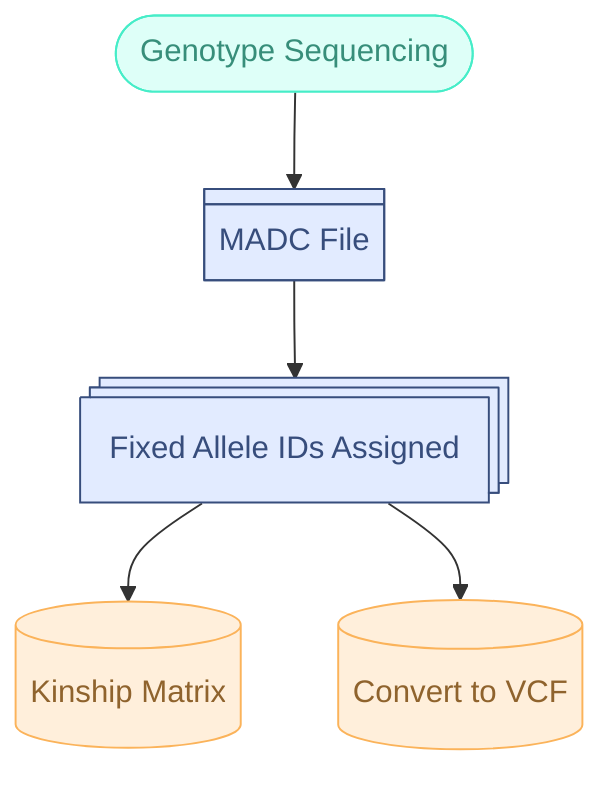

> Explanation of the MADC file format and the conversion to fixed allele ID at BI.
{: .prompt-info }

```mermaid
flowchart TD
    A(["Genotype Sequencing"]) --> B["MADC File"]
    B --> D["Fixed Allele IDs Assigned"]
    D --> n3["Kinship Matrix"] & n4["Convert to VCF"]
    B@{ shape: div-proc}
    D@{ shape: procs}
    n3@{ shape: db}
    n4@{ shape: db}
     A:::Aqua
     B:::Sky
     D:::Sky
     n3:::Peach
     n4:::Peach
    classDef Aqua stroke-width:1px, stroke-dasharray:none, stroke:#46EDC8, fill:#DEFFF8, color:#378E7A
    classDef Sky stroke-width:1px, stroke-dasharray:none, stroke:#374D7C, fill:#E2EBFF, color:#374D7C
    classDef Peach stroke-width:1px, stroke-dasharray:none, stroke:#FBB35A, fill:#FFEFDB, color:#8F632D
```